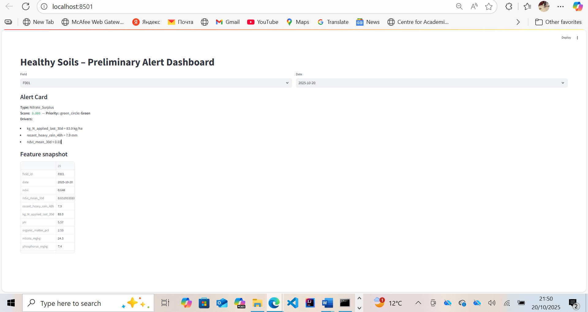
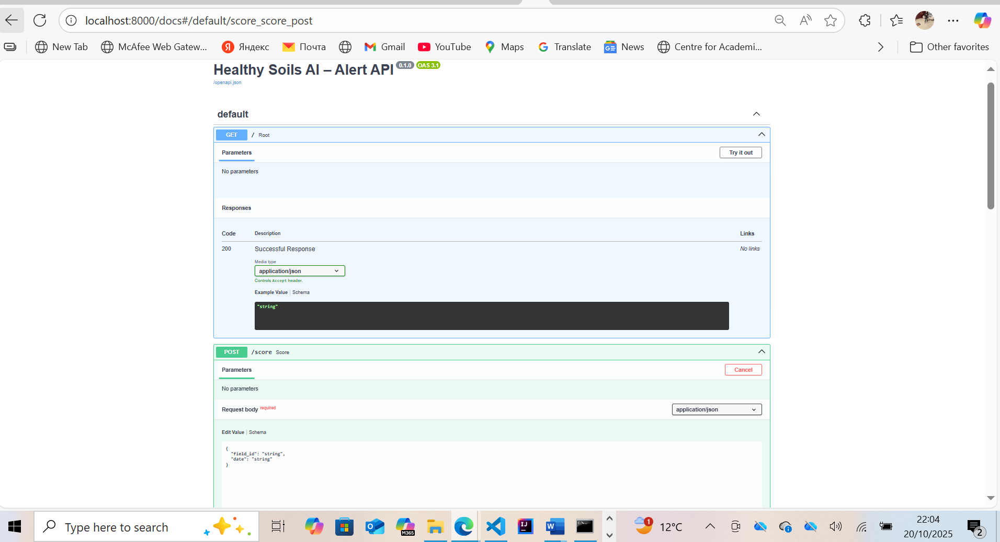
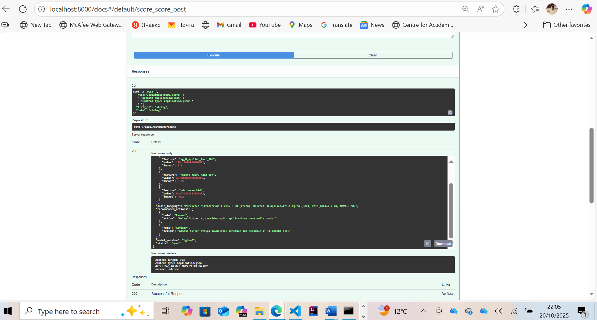
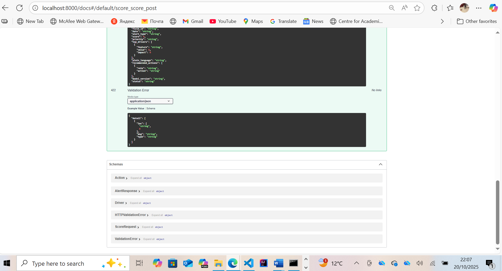

<p align="center">
  
</p>

# AI-Driven Decision Support for Soil Health and Nutrient Management

[](https://www.python.org/)
[](https://fastapi.tiangolo.com/)
[](https://streamlit.io/)
[](https://scikit-learn.org/)
[](https://github.com/ncvictorious/Agric-SoilHealth-AI/commits/main)
[](./LICENSE)

# AI-Driven Decision Support for Soil Health and Nutrient Management

This repository contains the feasibility prototype developed for the **DEFRA Agriculture & Soil Health Project** (Edora AI-Robotics Solutions Ltd, 2025).  
It demonstrates an **AI-driven pipeline** that predicts soil nutrient risks, visualises compliance alerts, and provides interpretable insights for farmers and regulators.

---

## Project Overview
This project integrates **synthetic environmental datasets**, **machine learning models**, and **interactive dashboards** to assess soil health in near real-time.

### Objectives
1. Generate a realistic synthetic dataset simulating UK agricultural soil and weather conditions.
2. Train and validate a baseline ML model to predict nitrate/runoff risks.
3. Build a FastAPI service exposing prediction endpoints.
4. Develop a Streamlit dashboard for visualising alerts and soil compliance insights.

---

## System Architecture


DATA → MODEL → API → DASHBOARD


| Layer | Description |
|-------|--------------|
| **Data Layer** | Synthetic datasets generated (soil, rainfall, NDVI, fertiliser, etc.) |
| **Model Layer** | Histogram-Based Gradient Boosting Classifier (scikit-learn) trained on engineered features |
| **API Layer** | FastAPI REST API (`/score`) serving Alert Cards with risk explanations |
| **Dashboard Layer** | Streamlit interface showing per-field risk indicators (Green / Amber / Red) |

---

## Model Performance (Synthetic Dataset)

| Metric | Result |
|---------|--------|
| **AUC** | 0.998 |
| **Accuracy** | 0.995 |
| **Precision / Recall / F1** | 0.667 / 0.667 / 0.667 |

These indicate strong predictive potential and a stable synthetic training environment.

---

## Project Structure
```

Agric-SoilHealth-AI/
│
├── data/ # Synthetic dataset package
├── outputs/ # Model, metrics, and plots
├── screenshots/ # Dashboard + API images
│ ├── alert_dashboard.png
│ ├── fast_api1.png
│ ├── fast_api2.png
│ └── fast_api3.png
│
├── generate_data.py # Step 1: Data generation
├── train_model.py # Step 2: Model training
├── serve_api.py # Step 3: FastAPI service
├── dashboard.py # Step 4: Streamlit dashboard
├── requirements.txt # Environment dependencies
│
├── Feasibility_Note_AI_Soil_Health.pdf
└── Technical_Overview.pdf
```

---

## How to Run Locally

1️⃣ Clone the Repository
```
git clone https://github.com/<yourusername>/Agric-SoilHealth-AI.git
cd Agric-SoilHealth-AI
```

2️⃣ Create a Virtual Environment
```
python -m venv .venv
.\.venv\Scripts\activate
pip install -r requirements.txt
```
3️⃣ Generate Data
```
python generate_data.py
```
4️⃣ Train the Model
```
python train_model.py
```
5️⃣ Run API
```
uvicorn serve_api:app --reload --port 8000
```

Visit http://localhost:8000/docs
 to interact with the endpoint.

6️ Launch Dashboard
```
streamlit run dashboard.py
```
## Screenshots
**FastAPI Interface – `/docs`**


**FastAPI Endpoint – `/score` Request**


**Model Response – Alert Card Output**


**Healthy Soils Dashboard – Streamlit View**


## Technical Stack
```
Python 3.11

scikit-learn 1.5

FastAPI 0.115

Streamlit 1.38

Pandas 2.2

Uvicorn 0.30
```
## Documentation

| Document | Description |
|-----------|-------------|
| [📄 Feasibility Note (PDF)](./docs/Feasibility_Note.pdf) | Summarises objectives, deliverables, and findings |
| [📘 Technical Overview (PDF)](./docs/Technical_Overview_System_Architecture.pdf) | Explains pipeline design, architecture, and next steps |


## Contact

Victor Chibueze Nwaobi
Lead Developer – Edora AI-Robotics Solutions Ltd
GitHub: @ncvictorious

## Acknowledgements

This feasibility prototype was developed for the
DEFRA Farming Innovation Programme (Feasibility Round 4)
as part of the AI for Sustainability initiative.

## Next Steps

Integrate real-world farm data (soil sensors, drone NDVI)

Retrain model for field variability and bias correction

Align with DEFRA Digital Regulation Hub guidelines

Conduct user testing with partner farms


